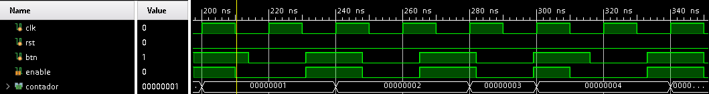
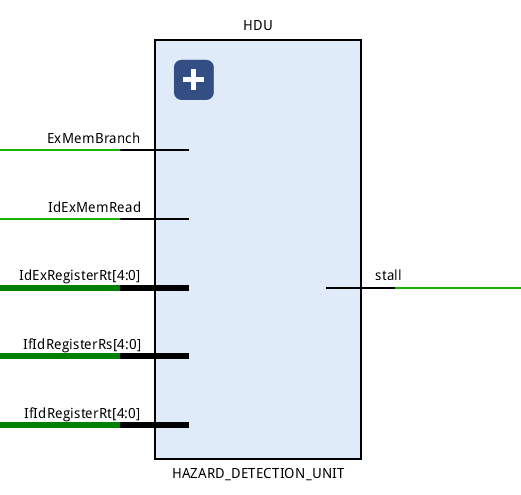

# Arquitectura de Computadoras - Ingeniería en computación

## Universidad Nacional de Córdoba - Facultad de Ciencias Exactas, Físicas y Naturales

### Trabajo Práctico Final: Procesador con *pipeline* utilizando MIPS simplificado

**Alumnos:**
- Collante, Gerardo
- Quinteros Castilla, Nicolás

**Profesores:**
- Ing. Rodríguez, Martín
- Ing. Pereyra, Martín
- Ing. Pinzani, Paulo

## Introducción

Con el nombre de MIPS (siglas de *Microprocessor without Interlocked Pipeline Stages*) se conoce a toda una familia de microprocesadores de arquitectura RISC (*Reduced Instruction Set Computer*) desarrollados por *MIPS Technologies*.

En este trabajo práctico se solicita implementar en el lenguaje de descripción de hardware `Verilog` (usado para modelar sistemas electrónicos usualmente) el *pipeline* del procesador *MIPS*.

## Requerimientos

### Etapas

Se solicita implementar las siguientes etapas del procesador:

1. `IF` *(Instruction Fetch)*: búsqueda de la instrucción en la memoria del programa.

2. `ID` *(Instruction Decode)*: decodificación de la instrucción y lectura de registros.

3. `EX` *(Execute)*: ejecución de la instrucción propiamente dicha.

4. `MEM` *(Memory Access)*: lectura o escritura desde/hacía la memoria de datos.

5. `WB` *(Write Back)*: escritura de resultados en los registros.

### Instrucciones

Se solicita implementar las siguientes instrucciones:

- `R-Type`: `SLL, SRL, SRA, SLLV, SRLV, SRAV, ADDU, SUBU, AND, OR, XOR, NOR, SLT`

- `I-Type`: `LB, LH, LW, LWU, LBU, LHU, SB, SH, SW, ADDI, ANDI, ORI, XORI, LUI, SLQTI, BEQ, BNE, J, JAL`

- `J-Type`: `JR, JALR`

### Riesgos

El procesador debe tener soporte para los siguientes tipos:

- **Estructurales**: se producen cuando dos instrucciones tratan de utilizar el mismo recurso en el mismo ciclo.

- **Datos**: se intenta utilizar un dato antes de que esté preparado. Mantenimiento del orden estricto de lecturas y escrituras.

- **Control**: intentar tomar una decisión sobre una condición todavía no evaluada.

Por tanto se deberá implementar una **unidad de cortocircuitos** y una **unidad de detección de riesgos**.

### Otros

El programa a ejecutar debe ser cargado en la memoria de programa mediante un archivo ensamblado, por tanto debe crearse un ensamblador.

## Ensamblador

Creado en Python, se encarga de traducir las instrucciones en *.asm* al código MIPS32bits correspondiente.

## Etapas o módulos principales

Se realizará una breve descripción de cada una de las etapas del procesador.

### `IF`

La etapa de *Instruction Fetch* corresponde a la búsqueda de la instrucción a la memoria para posteriormente ejecutarla.

**Esquemático general e I/O**

- `INCR`: Incrementa el valor del `PC`.

- `PC_MUX`: Este módulo a través del selector `{J,branch}` decide cual será el próximo valor del `PC`, ya sea el siguiente `PC` incrementado, el valor siguiente de PC o el PC del salto o la ramificación.

- `PC`: Asigna el valor al `PC`, además lo envía a `INCR` y `MEM`.

- `MEM`: El módulo posee un arreglo de instrucciones que fueron cargadas previamente, entonces el `PC` sirve como índice para obtener la instrucción.

- `IF_ID`: Es el *buffer* de salida, por tanto en el próximo flanco positivo de `clk`, se cargaran los valores haciendo avanzar la instrucción al siguiente *stage*. Recordemos que en el momento que la instrucción se encuentra disponible en algún *buffer* de salida también lo está para el siguiente *stage*. Además posee las entradas `J` y `B`, para el caso donde sea necesario *flushear* una instrucción y evitar que esta entre al pipeline ya sea por un salto o ramificación. También vale mencionar la entrada `stall`, que nos sirve para conservar los valores en el *buffer* aunque éste se encuentre habilitado realizando una parada del *pipeline*. Esta operación es necesaria para las instrucciones `lw` y `sw`.

### `ID`

El módulo `DECODE` nos provee funcionalidades para decodificar una instrucción, leer y escribir en GPR y finalmente controlar otras etapas a través de líneas de control.

- `REG`: Es el módulo encargado de almacenar valores en registros de propósito genereal. Para ello se vale de un arreglo de 32 posiciones de 32 bits cada uno. Para la lectura de valores, *i.e.*, `A` y `B` se indexa con `rs` y `rt` respectivamente. Sin embargo para escribir en la memoria es necesario que `regwrite` esté en alto, y así en el *rise edge* del `clk` se escribirán los datos de `writedata` en la pocisión indexada por `rd`.

- `CONTROL`: Nos permite controlar los futuros *stages* a través de líneas de control que serán `EX`, `M` y `WB` respectivamente, en función del *opcode* de la instrucción. Cada línea de control tiene una función especifica que se define en la siguiente Tabla [1](#tab:ctl2-table){reference-type="ref" reference="tab:ctl2-table"}.

- `JR_UNIT`: Unidad encargada de verificar si la instrucción es `JR`, en caso que lo sea se encarga de *switchear* a través de un `mux` los 26 bits LSB por el valor indicado en el operando. Además cambia el `opcode` al de una operación `J` (recordemos que la instrucción `JR` posee `opcode = b000000`, por tanto podría ser malinterpretada como una operación `NOP`).

- `BRANCH_UNIT`: Unidad encargada de realizar los cálculos para ver si una rama es tomada o no. Se apoya en multiplexores controlados a través de la `BRANCH FORWARDING UNIT` con el próposito de evitar peligros de datos.

- `S-EXTEND`: Incrementa el tamaño de la instrucción de 16bits a 32bits, replicando el bit de mayor orden en `[31:16]`.

- `ID_EX`: *Buffer* de salida encargado de cargar los valores para la siguiente etapa, recordemos que se activa por *rise edge* de `clk`.

### `EX`

Este módulo es el encargado de realizar las diferentes operaciones con los operandos en la ALU.

**Esquemático general e I/O**

- `ALU_CONTROL`: este módulo nos es útil para controlar la operación ejecutada por la ALU. Para esta labor se sirve del `opcode` y `funct` de la instrucción.

- `ALU_MUX`: la `FU` (*Forwarding Unit*) es la encargada de los controles de peligros así como también la encargada de decidir los valores que operará la `ALU` ya que `A` está definida por `FORWARD_MUX_A` y `B` si bien se define por `sel` (`EX[0]`), `b` es provisto por `FORWARD_MUX_B`.

- `ALU`: la `ALU` es capaz de ejecutar todas las operaciones indicadas en la sección [2.2](#section:instr){reference-type="ref" reference="section:instr"}, ya sean de *R-type* como de *I-type*.

- `BOTTOM_MUX

- `JAL UNIT`: unidad especial encargada de detectar una instrucción `JAL` con el objetivo de cargar el `PC` en el registro `$ra` (recordar que esta instrucción es complementaria a la instrucción `JR $ra`), apoyandose en el modulo `alu_result_mux` que es un multiplexor entre la salida de la ALU y el valor del `PC`. En caso que no sea detectado todo sigue su curso normal.

- `EX_MEM`: *Buffer* de salida del módulo.

- `FORWARD_MUX_A`

- `FORWARD_MUX_B`

- `FORWARDING UNIT`

**Esquemático general e I/O**

En determinadas ocasiones en una etapa necesitamos un dato que aún no se ha terminado de procesar en otra, o quizás si pero aún el dato no ha sido guardado. Esto puede llevar a lo que se denomina parada o *stall* del *pipeline*, ya que necesitamos uno o más ciclos de reloj para obtener el dato. Esto acomete contra nuestro objetivo de rendimiento, por tanto necesitamos una manera de combatirlo.

Esto significa *e.g.* que cuando una instrucción intenta usar un registro en su etapa `EX`, una instrucción anterior intenta escribir en su etapa `WB`, pero en realidad necesitamos los valores como entradas a la `ALU` más que en memoria.

#### Condiciones de peligro

**Peligro EX**

`if(EX/MEM.RegWrite and (EX/MEM.RegisterRd != 0)`

`and (EX/MEM.RegisterRd = ID/EX.RegisterRs)) ForwardA = 10`

`if(EX/MEM.RegWrite) and (EX/MEM.RegisterRd != 0)`

`and (EX/MEM.RegisterRd = ID/EX.RegisterRt)) ForwardB = 10`

**Peligro MEM**

`if (MEM/WB.RegWrite && (MEM/WB.RegisterRd != 0)`

`&& not(EX/MEM.RegWrite && (EX/MEM.RegisterRd != 0)`

`&& (EX/MEM.RegisterRd != ID/EX.RegisterRs))`

`&& (MEM/WB.RegisterRd = ID/EX.RegisterRs)) ForwardA = 01`

`if (MEM/WB.RegWrite && (MEM/WB.RegisterRd != 0)`

`&& not(EX/MEM.RegWrite && (EX/MEM.RegisterRd != 0)`

`&& (EX/MEM.RegisterRd != ID/EX.RegisterRt))`

`&& (MEM/WB.RegisterRd = ID/EX.RegisterRt)) ForwardB = 01`

Estas condiciones serán implementadas a través de dos multiplexores, `ForwardA` y `ForwardB`.

- `BOTTOM_MUX`: Este módulo es útil para obtener `rd` en el *buffer* `EX_MEM`, debido a que utiliza como selector a `EX[3]` que equivale a `RegDst`. Cuando este valor es 1, entonces selecciona `rd` como salida del multiplexor.

### `MEM`

**Esquemático general e I/O**

- `D_MEM`: Equivale a la memoria RAM, posee un arreglo de 128 posiciones de 32 bits cada una. Su funcionamiento es sencillo, `Address` funciona como índice del arreglo y tanto para leer como para escribir debemos setear los valores `MemWrite` como `MemRead` respectivamente como vimos en la Tabla [1](#tab:ctl2-table){reference-type="ref" reference="tab:ctl2-table"}.

- `MEM_WB`: *Buffer* de salida del *stage*.

### `WB`
El funcionamiento de este módulo es muy simple, básicamente decide a través del selector `MemtoReg` si `WriteData` será el valor leído desde memoria o el resultado de la `ALU`.

**Esquemático general e I/O**

### `DEBUG UNIT`

Debido a la imposibilidad de utilizar la placa físicamente se solicitó la creación de una unidad de *debugging* cuyo propósito era el de emular el paso a paso del *pipeline* siendo cada paso accionado a través de un botón.

Esto generaba un pulso `enable` que es entrada de cada uno de los *buffers* de salida de cada etapa. Así para avanzar en el *pipeline* era condición necesaria que la señal `enable` estuviera en alto además de la señal del `clk`.

### `HAZARD DETECTION UNIT`

Su tarea es detectar un peligro de datos que sucedería en el caso que una función `lw` o `sw` necesite un dato que aún no se encuentra disponible.

En el caso que eso ocurra se realiza una parada congelando el *buffer* `IF_ID` para que no avance permitiendo así avanzar a las demás etapas del *pipeline* y se comprueban varias condiciones:

`if(IdExMemRead &&`

`(IdExRegRt == IfIdRegRs)` `|| (IdExRegRt == IfIdRegRt))`

`stall the pipeline`

### `BRANCH FORWARDING UNIT`

Se tomó la decisión de ejecutar las operaciones de rama en el stage `ID` debido a que esto sólo necesitaba realizar en una ocasión *flush*, en vez de tres que es lo que hubiera sucedido si realizabamos estas operaciones en el stage `MEM` como se propone en el libro *Arquitectura de Computadoras* de *Hennesy & Patterson*.

El inconveniente con realizar estas operaciones en `ID` es que esto puede llevar a riesgos de datos que debemos solucionar.

Básicamente los riesgos que podemos sufrir son desde los *buffers* `EX_MEM`, `MEM_WB` e incluso `ID_EX` (pero este caso no será analizado porque es salvado por la `HDU`).

- *Forwarding* desde `EX_MEM`

Podemos observar que la operación 2 (`or`) realiza una operación y guarda el resultado en el operando `$v0`, pero el inconveniente es que aún ese resultado no se guardó y `beq` lo necesita, por tanto hacemos *forwarding*.

En este caso, en el momento que el resultado es guardado es solicitado por `bne`, por tanto debemos realizar un *forwarding* desde `MEM_WB`.

### Funcionamiento

El funcionamiento de la `BFU` se resume en el siguiente gráfico donde observamos que es la encargada a través de los selectores de los multiplexores de elegir los operandos `reg1` y `reg2` que serán necesarios en el cálculo para decidir si la rama será tomada o no.

#### Timing Analysis Report

Este reporte nos sirve para interpretar cuestiones referentes al tiempo que tardan las diferentes compuertas (y su respectivo *fanout*) en ejecutar las instrucciones para darnos una idea si nuestro diseño una vez sintetizado y quemado en la placa real tendrá el comportamiento deseado.

En nuestro caso con un *clk* de $100Mhz$ no cumplíamos los requerimientos previstos obteniendo valores negativos, *i.e.* debemos ralentizar el *clk* para que todos los paths de nuestro diseño se ejecuten correctamente. Por tanto, bajamos el *clk* a $30Mhz$ obteniendo así valores correctos que veremos a continuación en la siguiente imagen.

- Parámetros:
  - *Setup*: incluye todas las verificaciones relacionadas al análisis de máximo *delay*, configuración, recuperación y verificación de datos.
    - *WNS (Worst Negative Slack):* Este valor corresponde a la peor holgura de tiempo de todos los *timing paths* para el análisis de máximo *delay*.
    - *TNS (Total Negative Slack):* Este valor corresponde a la suma de todas las violaciones de *WNS* considerando la peor violación de cada *timing path endpoint*. Su valor es $0ns$ cuando todas las *constraints* son encontradas para el analisis de máximo *delay*, o negativo cuando hay algunas violaciones.
    - *Failing Endpoints*: es el número total de *endpoints* con una violación ($WNS<0ns$).
  - *Hold*: incluye todas las verificaciones relacionadas al análisis de tiempo mínimo: retención, recuperación y verificación de datos.
    - *WHS (Worst Hold Slack)*: Este valor corresponde a la peor holgura de tiempo de todos los *timing paths* para el análisis de mínimo retardo.
    - *THS (Total Hold Slack):* Este valor corresponde a la suma de todas las violaciones de *WHS* considerando la peor violación de cada *timing path endpoint*. Su valor es $0ns$ cuando todas las *constraints* son encontradas para el analisis de máximo *delay*, o negativo cuando hay algunas violaciones.
  - *Pulse Width*: incluye todas las verificaciones relacionadas relacionadas al límite de *switching* de pines:
    - *WPWS (Worst Pulse Width Slack)*: este valor corresponde a la peor holgura de todas las verificaciones de *timing* listadas arriba cuando se usan los *delays* mínimos y máximos.
    - *TPWS (Total Pulse Width Slack)*: este vañpr es la suma de todas las violaciones *WPWS*, cuando consideramos solamente la peor violación de cada pin en el diseño.
    - *Failing Endpoints:* Este es el número total de pines con una violación ($WPWS<0ns$).

Así en síntesis comprobamos los valores obtenidos son correctos y en teoría al probar nuestro diseño en la placa no tendremos problemas de *timing*.

### Conclusiones

Un gran punto de este trabajo práctico es que al tener que crear todas las partes concernientes al funcionamiento de un computador a bajo nivel (desde el ensamblador hasta el *pipeline*) esto da un enfoque global de todo el proceso, que resulta muy beneficioso para la comprensión de su funcionamiento.

Este conocimiento a su vez nos es provechoso para asentar las bases teóricas de la materia a través de la práctica. A medida que se avanzaba en la implementación surgieron problemas que requirieron de ingenio para su resolución, así se logró profundizar en situaciones que quizás de manera solamente teórica hubieran sido pasadas por alto.

En últimas palabras, el trabajo da un cierre a la materia que reúne todo el contenido de la misma atando todos los cabos a través de la práctica.
